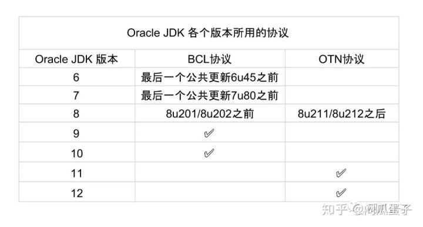

# Java生态
### 什么是Java
> Java 是由 Sun Microsystems 在 1995 年首先发布的编程语言和计算平台。有许多应> > 用程序和 Web 站点只有在安装 Java 后才能正常工作，而且这样的应用程序和 Web 站点> > 日益增多。Java 快速、安全、可靠。从笔记本电脑到数据中心，从游戏控制台到科学超级> > 计算机，从手机到互联网，Java 无处不在！

### 简史
- 1995年5月23日，Java语言诞生;
- 1997年4月2日，JavaOne会议召开，参与者逾一万人，创当时全球同类会议纪录;
- 1999年6月，SUN公司发布Java三个版本：标准版（J2SE）、企业版（J2EE）和微型版（J2ME）;
- 2000年5月8日，JDK1.3发布;
- 2000年5月29日，JDK1.4发布;
- 2004年9月30日，J2SE1.5发布，成为Java语言发展史上的又一里程碑。为了表示该版本的重要性，J2SE1.5更名为Java SE 5.0;

### 特点
> 简单、面向对象、分布式、解释执行、鲁棒、安全、体系结构中立、可移植、高性能、多线程以及动态性。

### JavaOne

### JCP
Java Community Process ，Java社区进程
JCP成立于1998年，官网，由社会各界Java组成的社区，规划和领导Java的发展，其成员可以在这里看到

### JSR
Java Specification Requests，Java规范请求，由JCP成员向委员会提交的Java发展议案，经过一系列流程后，如果通过最终会体现在未来的Java中

### TCK
Technology Compatibility Kit，技术兼容性测试
如果一个平台型程序想要宣称自己兼容Java，就必须通过TCK测试

### JEP
JDK Enhancement Proposal，a process used by the OpenJDK community for collecting proposals for enhancements to the Java Development Kit.

### OracleJDK：已经不是以前的少年了
- BCL协议，即Oracle Binary Code License Agreement，协议规定你可以使用JDK，但是不能进行修改。私用和商用都可以，但是JDK中的某些商业特性，是需要付费才可以使用的
- OTN协议，即Oracle Technology Network License Agreement，目前新发布的JDK用的都是这个协议，可以私用，商用需要付费。

> 小结：非商用问题不大

### OpenJDK：还是以前那个少年没有改变（推荐）
> 轻松应对商用和非商用

### Other JDK
> Zulu，AdoptOpenJDK，大家有兴趣的可以自行研究

# 参考资料
- https://zhuanlan.zhihu.com/p/64731331