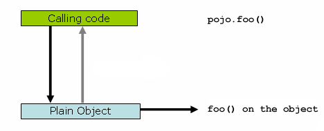

### AOP原理介绍
- AOP使用JDK动态代理 或 CGLIB来实现代理
- JDK动态代理：当代理的目标对象实现至少一个接口，那么接口实现类都会被代理
- CGLIB：代理每个目标类的方法，所以注意final修饰的方法
- Spring4：代理类的构造函数不会调用两次，因为代理的实例会通过Objenesis直接创建（除非JVM不允许构造函数代理，我们可能会看到双重调用和相关debug日志）
- proxy-target-class="true"： 开启使用

#### 运行时AOP
- 类内部中的正常调用：AOP失效
```java
public class SimplePojo implements Pojo {

    public void foo() {
        // this next method invocation is a direct call on the 'this' reference
        this.bar();
    }

    public void bar() {
        // some logic...
    }
}
```

 - 类内部中的正常调用：AOP生效
```java
public class SimplePojo implements Pojo {

    public void foo() {
        // this works, but... gah!
        ((Pojo) AopContext.currentProxy()).bar();
    }

    public void bar() {
        // some logic...
    }
}
```

- 类引用下的方法调用：AOP生效
```java
public class Main {

    public static void main(String[] args) {
        Pojo pojo = new SimplePojo();
        // this is a direct method call on the 'pojo' reference
        pojo.foo();
    }
}
```


### 参考资料
- https://github.com/dunwu/javacore/blob/master/docs/basics/java-reflection.md

- https://docs.spring.io/spring-framework/docs/current/reference/html/core.html