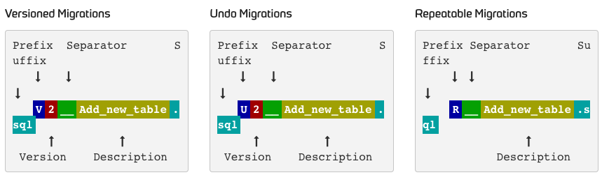

### 底层模型和逻辑

- 核心表 flyway_schema_history：基于此开展脚本执行逻辑，同时记录 SQL 迁移和执行的完整快照
<table style="font-size:8px">
        <tbody><tr>
            <th>installed_rank</th>
            <th>version</th>
            <th>description</th>
            <th>type</th>
            <th>script</th>
            <th>checksum</th>
            <th>installed_by</th>
            <th>installed_on</th>
            <th>execution_time</th>
            <th>success</th>
        </tr>
        <tr>
            <td>1</td>
            <td>1</td>
            <td>Initial Setup</td>
            <td>SQL</td>
            <td>V1__Initial_Setup.sql</td>
            <td>1996767037</td>
            <td>axel</td>
            <td><nobr>2016-02-04 22:23:00.0</nobr></td>
            <td>546</td>
            <td>true</td>
        </tr>
        <tr>
            <td>2</td>
            <td>2</td>
            <td>First Changes</td>
            <td>SQL</td>
            <td>V2__First_Changes.sql</td>
            <td>1279644856</td>
            <td>axel</td>
            <td>2016-02-06 09:18:00.0</td>
            <td>127</td>
            <td>true</td>
        </tr>
    </tbody>
</table>
- 迁移状态：Migration State（更多参见[官网][ms]）
<table style="font-size:8px">
  <tbody>
    <tr>
      <th>状态</th>
      <th>说明</th>
    </tr>
    <tr>
      <td>Pending</td>
      <td>未完成</td>
    </tr>
    <tr>
      <td>Success</td>
      <td>成功</td>
    </tr>
  </tbody>
</table>

### 核心概念

- 迁移（Migration）：整体分两种类型：版本化（又区分常规和回滚） 和 可重复化
  1. 版本化迁移（Versioned Migration）：需有版本、描述和版本签名
     - 常规版本：DDL 和 DML，同时需要确保 version 的唯一性；
     - 回滚版本：考虑到生产权限管理和数据安全性，不推荐使用；
  2. 可重复迁移（Repeatable Migration）：仅需描述和签名
  3. 基于 SQL 的迁移（Java/Script 暂不展开介绍）
     
     - Prefix: V for versioned (configurable), U for undo (configurable) and R for repeatable migrations (configurable)
     - Version: Version with dots or underscores separate as many parts as you like (Not for repeatable migrations)
     - Separator: \_\_ (two underscores) (configurable)
     - Description: Underscores or spaces separate the words
     - Suffix: .sql (configurable)
  
- 回调（Callback）：支持基于 SQL/Java/Script 回调方式
- 错误美化（Error Overrides）
- Dry Runs
- State Script

[ms]: https://flywaydb.org/documentation/concepts/migrations#migration-states
