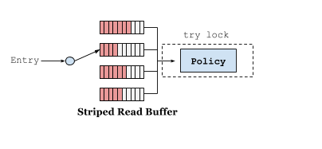
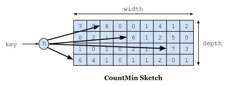
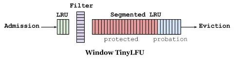

### 核心组件和依赖
- org.springframework.cache.Cache
- org.springframework.cache.CacheManager

### 支持的缓存中间件
- EhCache 2.x
- Caffeine
- Redis
- 其他：JCache、Generic

### 核心注解
- @Cacheable：设置缓存，可以定义condition，自定义cacheManager
- @CachePut：提前更新缓存
- @CacheEvict：更新缓存策略：按条件、全局更新
- 多类型的CacheManager使用：配合@Primary进行使用

### Caffeine介绍
#### 核心特性
- 高性能（Caffeine 认为读操作是频繁的，写操作是偶尔的，读写都是异步线程更新频率信息）
  - 读缓冲：RingBuffer
  
  

  - 写缓冲：MpscGrowableArrayQueue
- 最佳缓存：W-TinyLfu
  - 4bit CountMin Sketch算法
  


  - LRU 和 Segmented LRU
  


#### 

#### 基本使用
- 导入Maven包
``` java
<dependency>
            <groupId>com.github.ben-manes.caffeine</groupId>
            <artifactId>caffeine</artifactId>
        </dependency>
```
- 初始化
``` java
@Bean
    @Primary
    public CacheManager cacheManager() {
        return new CaffeineCacheManager();
    }
```

#### 参考资料
- https://zhuanlan.zhihu.com/p/348695568
- https://github.com/ben-manes/caffeine